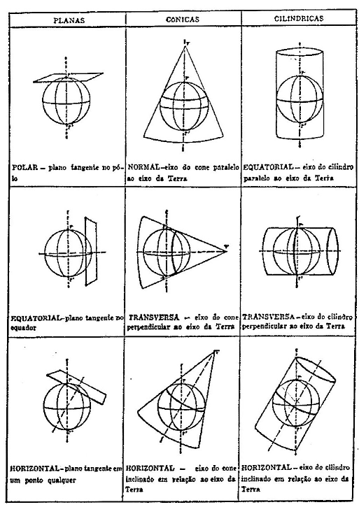

```{r setup, include=FALSE}
knitr::opts_chunk$set(echo      = TRUE, 
                      warning   = FALSE, 
                      message   = FALSE, 
                      fig.path  = paste0(getwd(), "/figuras/"), 
                      fig.ext   = 'png',
                      fig.align = 'center',
                      collapse  = TRUE, 
                      out.width = "75%")
```

```{r bibliotecas}
library(sf)
library(raster)
library(ggplot2)
library(dplyr)
library(tmap)
library(ggmap)
```


\
---
\

### 1- Introdução

 <div style="text-align:justify" markdown="1">
 
A inclusão da informação espacial nos dados estatísticos introduz um elemento qualitativo importante, tanto na etapa de análise, quanto na de disseminação da informação e tem-se tornado tema recorrente no ámbito do geoprocessamento e da estatística. Essa tendência global também se consolida a nível nacional, (criação da Infraestrutua Nacional de Dados Espaciais - INDE), assim como no IBGE, por exemplo, com a realização em 2016 de um Seminário de Metodologia que foi denominado “Integração de Dados Estatísticos e Geoespaciais e Visualização de Informações” ou ainda o planejamento do novo CensoGeo, previsto para o ano de 2022. 

A representação espacial se formaliza por meio do conceito de **feição simples** ou **_simple feature_**. A feição está definida na norma **ISO 19125-1:2004** que descreve como os objetos do mundo real podem ser representados em computadores, enfatizando o aspecto da geometria espacial. 

A norma estabelece também como esses elementos podem ser armazenados e recuperados de bases de dados e ainda que tipo de operações podem ser efetuadas. Esse padrão é amplamente usado e implementado em bases de dados (como PostGis) e software de  Sistemas de Informação Geográfica – SIG, como QGIS e ArcGis. Uma feição pode ser, por exemplo, uma casa, uma árvore ou uma estrada. Da mesma forma, um conjunto de feições pode-se considerar uma única feição, um conjunto de árvores pode ser uma floresta ou um conjunto de casas, uma vila ou cidade.

Esta documentação, de caráter introdutório, tem como **objetivo apresentar formas de tratar e visualizar os dados no _R_, considerando sua geometria e espacialidade **. Não tem a intenção de substituir o uso de SIG, principalmente na elaboração de mapas, cartogramas finais ou análises complexas, mas mostrar que é possível manipular e visualizar dados espaciais sem ter que, nesse processo, fazer o caminho do _R_ ao SIG e vice-versa várias vezes. Para isso serão apresentados dois pacotes específicos: `sf` e `raster`, além de alguns  para visualização. 

Especificamente, o pacote `sf` para dados vetoriais, facilita a leitura e manipulação se comparado a pacotes anteriores, como o `sp`, já que os objetos `sf` são dataframes com atributos espaciais e podem ser manipulados como tais usando pacotes como `tidyverse::dplyr`. Os objetos criados contém os metadados do SGR e guardam numa única coluna os atributos de georrefenciamento. A representação das feições é similar ao **PostGIS** e todas as funções comecam com o prefixo `st_`, em referência a espacio e tempo, facilitando assim sua búsqueda e uso.

O anterior pacote de manipulação de dados georreferenciados `sp` tem uma longa trajetória no sistema _R_ e está amplamente difundido sendo incluído como dependência em diversos pacotes, já o novo pacote `sf` está em fase de desenvolvimento, mas tem um futuro muito promissor enquanto mais simples de usar. Desta forma, é importante conhecer como é feita a conversão de formato entre os dois pacotes, a fim de aproveitar ao máximo os benefícios de ambos.

</div>

A transformação de um objeto `sf` em `sp` e viceversa, pode ser feita da seguinte forma:

  1- `sf` em `sp`, usando a função `as`:
  
    objeto_sp <- as(objeto_sf, Class = "Spatial")
  
  2- `sp` em `sf`, usando a função `st_as_sf`:
  
    objeto_sf <- st_as_sf(objeto_sp)
 
 Em relação aos dados matriciais ou _raster_, o pacote `raster` permite a manipulação e visualização de dados desse tipo. Vale salientar a aparição de um novo pacote `star`, em fase de desenvolvimento, que tratará todo tipo de dados espaço-temporais, vetoriais e matriciais, numa abordagem do tipo `tidyverse`.

Nesta primeira parte veremos alguns conceitos teóricos necessários para entender como se configuram e relacionam os dados com o espaço terrestre.

Nos próximos documentos trataremos de:

  . como importar dados vetoriais com o pacote `sf`.
  
  . como importar dados matriciais ou _raster_ com uma ou várias camadas, usando o pacote `raster`.
  
  . manipulação e transformação dos dados vetoriais e matriciais.
  
  . gravação de objetos vetoriais ou matriciais, com os pacotes `sf` e `raster`.
  
  . algumas funções de análisis de dados georreferenciados.
  
  . visualização de dados georreferenciados, com os pacotes `plot`, `tmap`, `ggmap`, `ggplot`.
 
\
--- 
\

### 2- Objetos classe S-3 e S-4

---

#### a- Definição

<div style="text-align:justify" markdown="1">

Para entender como os dados espaciais são tratados no _R_, precisamos ver que tipos de sistemas orientados a objeto suporta e em qual deles, esses dados se encaixam.

O _R_ tem várias classes de sistemas orientados a objeto, as mais usadas são S3 e S4, cada uma com sua definição, atributos e métodos específicos. 

Quando é criado um vetor, ou fazemos a importação de uma tabela, dataframe ou lista estamos criando objetos S3. O pacote `sf` define os objetos como do tipo S-3, facilitando assim sua manipulação e dos seus atributos. Mas específicamente os objetos `sf` são uma sub-classe da classe `data.frame` e da classe `tbl_df`.

Os objetos S4, usados nos dados raster ou matriciais, são derivados do S3 e possuem uma definição mais formal da classe. Em dados espaciais, os pacotes `raster` e `sp`criam objetos classe 4.

Na tabela seguint apresentamos as principais diferenças entre as classes S-3 e S-4

|Classe S-3             | Classe S-4              |
|-----------------------|-------------------------|
|Sem definição formal| Classe definida com setClass()|
|Objetos criados com atributo de classe|Objetos criados usando new() ou com pacotes específicos como `raster`|
|Acesso de atributos com \$|Acesso de atributos com \@ ou usando slots()|

</div>

---

#### b- Representação e geometria vetorial

<div style="text-align:justify" markdown="1">

Os objetos do mundo real precisam ser representados usando tipos diferentes de geometria. Toda geometria é composta de pontos simples da mesma classe, em diferentes espaços dimensionais. 
 
Assim sendo podemos representar os objetos usando três tiposbásicos  de geometria: **ponto, linha e polígono**. Um ponto pode ser representado numa superficie por dois atributos espacias, X e Y, que são suas coordenadas. Uma linha é uma sucessão de pontos e um polígono é uma sucessão de linhas que não se cruzam e fecham num determinado ponto inicial. No _R_ , é possível a combinação no mesmo objeto  de diversas geometrias como pontos, linhas e polígonos, o que não acontece nos SIG.

As geometrias mencionadas são representados num espacio bidimensional. Podemos incluir uma terceira e ou uma quarta dimensão, incluindo atributos como altitudes ou tempo por exemplo (dimensões Z ou M respectivamente). Assim sendo podemos representar o crescimento de uma árvore ao longo da sua vida usando as variáveis X e Y para dar a localização espacial, Z para registrar o crescimento em altura e M para estabelecer a data de cada medição.

Em resumo um **objeto pode ser representado espacialmente** por um conjunto de coordenadas com as seguintes caracteristicas:

  - X, Y  - localização espacial (bidimensional)
  
  - X, Y, Z  - localização espacial + altura ou altitude (tridimensional)
  
  - X, Y, M  - localização espacial + outra variavel medida (tridimensional)
  
  
  - X, Y, Z, M - localização espacial + altura ou altitude + outra variavel medida (quadridimensional)

---

No pacote `sf`, os principais tipos de representação da geometria de feiçoes simples  são:
 
  1- _**POINT**_ : geometria com dimensão zero contendo um único ponto, representado numa superfície por um par de coordenadas;
  
  2- _**LINESTRING**_: geometria unidimensional composta de uma sequencia de pontos (_**POINT**_), conectados por linhas que não se intersectam;
  
  3- _**POLYGON**_: geometria bidimensional com uma area positiva, formada por uma sequência de anéis de pontos fechados e não intersectados. O primeiro anel será o polígono exterior e os seguintes delimitan espaços vazios interiores, se eles existirem;
  
  4- _**MULTIPOINT**_: conjunto de pontos, chamado de simples se não tem 2 pontos iguais. Cada ponto possui seu par de coordenadas;
  
  5- _**MULTISTRING**_: conjunto de _**LINESTRING**_ ;
  
  6- _**MULTIPOLYGON**_: conjunto de _**POLYGON**_;
  
  7- _**GEOMETRYCOLLECTION**_: conjunto de geometrias de qualquer tipo das anteriores mencionadas.

Existem mais 10 geometrias especiais que não serão tratadas neste momento e que podem ser consultadas na documentação do pacote `sf`. 

O armazenamento das feições se efetua da seguinte maneira:

  + o **objeto `sf`**, classe 3, possui as seguintes propriedades: 
  
    1- um tipo geometria (alguma das mencionads anteriormente), 
    
    2- um tamanho (quantidade de feições e atributos), 
    
    3- uma extensão espacial ( _bounding box_ ou _bbox_), e um 
    
    4- _CRS_ (que pode ser desconhecido, ou seja  _NA_).

  + os atributos das feições são armazenados num objeto de tipo `dataframe`, denominado de classe`sf`, que contém obrigatoriamente as seguintes duas classes:
  
    1- objeto da classe `sfc`. Devido a que a geometria pode ter diversos valores, ela é armazenada numa única coluna contendo objetos tipo `list`. Essa coluna tem o mesmo tamanho do numero de registros (linhas) no `dataframe`;
  
    2- Objeto da classe `sfg`. A geometria de cada feição e armazenada num objeto `list`, contido dentro do objeto `sfc`.
  
A seguinte figura mostra como esta organizado um objeto desta classe `sf`. No cabeçãlho se indica a quantidade de feições e atributos, o tipo e dimensão da geometria, a extensão espacial e o CRS. Em amarelo destáca-se o dataframe (classe `sf`), em verde a geometria (numa coluna de tipo lista, classe `sfc`) e em vermelho a geometria de uma feição (neste caso do 3o. registro, classe `sfg`). 

O objeto da figura é um arquivo multipolígono contendo 6 feições com três variáveis cada. Os 6 registros correspondem ao limites de alguns municípios de RJ e as três variáveis são: um identificador, o geocódigo do município e o nome do mesmo.

 Cada classe mencionada tem seus próprios metodos, para ver a lista completa deles, execute `methods(class = "sf")`. Experimente ver os métodos das outras duas classes, `sfc` e `sfg`.

 </div>


</div>
 
---

<div style="text-align:justify" markdown="1">

#### c- Dados matriciais ou _raster_

Um arquivo ou dado _raster_ é uma estrutura de dados que divide o espaco em porções retangulares iguais chamadas células ou _pixels_, as quais podem armazenar um ou mais valores em cada célula. Essa estrutura é também conhecida como **grade** ou **quadricula**, em contraposição aos dados de tipo vetorial já vistos.

O pacote `raster` tem funções para ler, manipular e gravar dados matricias em forma muito eficiente, já que não precisa carregar os dados em memoria para executar as operacoes mencionadas. Isto se torna relevante já que normalmente os dados raster são de grande volume. Os objetos criados com esse pacote são da classe S-4.

O pacote `raster`permite importar tem 3 tipos de objetos. Básicamente todos eles armazenam os seguintes atrubutos ou _slots_:

    - o número de colunas e linhas, 
    
    - as coordenadas da extensão espacial (um objeto da classe "extent") e 
    
    - o SGR (objeto da classe "proj.4" além do código EPSG, se disponível). 

O _raster_ também pode armazenar o(s) valor(es) específicos de cada célula e variável (camada). **Importante: As coordenadas estão referidas aos extremos da grade (esquinas) e não ao centro de cada célula como o fazem alguns software de SIG.**

Os três tipos de objetos raster são: 

  + `RasterLayer`, representa um camada única de dados. Um exemplo pode ser um modelo digital de elevações (MDE) ou a superfície de temperaturas produzidas por uma rede de estações metereológicas;
  
  + `RasterBrick`, usado para representação de mais de uma variável ou camada ( _multi-layer_), mas que pertencem a um único arquivo. Um típico exemplo é uma imagem de satélite multiespectral; e 
  
  + `RasterStack`, para representação de mais de uma variável, as quais podem pertencer a diferentes arquivos ou a uma combinação de algumas camadas de um arquivo único. É obligatório que os limites espaciais e a resolução de todas as camadas sejam as mesmas.

A forma mais simples de criar um objeto _raster_ é através da leitura de um arquivo. O pacote permite ler os formatos mais comuns como GeoTIFF, ERDAS, ESRI, ENVI, etc, usado a biblioteca `rgdal`. Dependendo do tipo de arquivo que importamos serão usadas as funções `raster()`, `brick()` ou `stack()`.

</div>

---

<div style="text-align:justify" markdown="1">

### 3- Sistema Geodésico de Referência – SGR ( _CRS_)

Quando falamos em dados georreferenciados ou espaciais, estamos dizendo que eles tem um atributo que os relaciona com a superfície terrestre, esse atributo é a geometria como foi definida no título anterior. A relação com a superfície terrestre é estabelecida por meio de coordenadas, que pertencem a um **Sistema Geodésico de Referência – SGR**. No _R_, o SGR é chamado de **_Coordinate Reference System – CRS_**. 

Os elementos integrantes de um _CRS_ são: um **modelo da Terra**, um **sistema de coordenadas** e um **ponto terrestre de origem**, no qual se posiciona a origem do nosso sistema de coordenadas. 

Referente ao **modelo da Terra**, são usados principalmente dois modelos: o **esférico** e o **elipsoidico**. Este último tem uma maior aproximação à forma real da Terra, já que se definem dois eixos do elipsoide de diferentes tamanhos, e assim é possível modelar o achatamento existente nos polos (o raio polar é aproximadamente 11,5 km menor que o equatorial). Em algumas aplicações cartográficas não existe diferença em usar qualquer um desses modelos.

Os **sistemas de coordenadas** podem ser do tipo **geográfico** (definidos por latitude e longitude) ou **projetado** (eixos Leste e Norte, ou X e Y). A escolha determina como os eixos do modelo terrestre são divididos e as unidades de medida. Enquanto as unidades dos sistemas geográficos são angulares e medidas em graus, as dos sistemas projetados são lineares e medidas em metros (m).

**Ponto terrestre de origem**, esse ponto determina a origem da escala de nossos eixos de coordenadas. Anteriormente era definido na superfície terrestre por meio de medições astronômicas (sistema local). Nos dias de hoje, os sistemas de referência tem sua origem no geocentro, definido usando técnicas de posicionamento por satélites (sistemas globais).

Os elementos definitórios mencionados: **modelo terrestre, ponto terrestre de origem e , sistema de coordenadas**, caraterizam cada SGR. Em particular a escolha dos elementos: modelo terrrestre e o ponto terrestre de origem denomina-se de _Datum_. O _Datum_ SIRGAS2000, por exemplo, tem o elipsóide GRS80 como modelo terrestre e o geocentro terreste como ponto inicial. Nesse _Datum_ podemos escolher trabalhar com sistemas de coordenadas geográficas ou um sistema de coordenadas projetadas, como por exemplo o _Universal Transverse Mercator - UTM_ para a localização das feições.

<div/>

\
---
\

<div style="text-align:justify" markdown="1">

#### a- _CRS_ não projetado ou de coordenadas geográficas

Na definição do sistema, vimos que são escolhidos um elipsoide determinado (SIRGAS, WGS84, Internacional, etc.), um ponto de origem (modernamente o geocentro) e um sistema de coordenadas. Em relação as coordenadas do tipo geográficas, usa-se a **latitude** e a **longitude** para a localização espacial dos objetos. A **latitude** é a distância angular a partir do paralelo 0º, ou Equador, contada no sentido Polo Sul (latitude -90º) ou no sentido Polo Norte (latitude +90º). A **longitude** é a distância angular a partir do meridiano 0º, ou de Greenwich, contada no sentido leste (longitudes de 0º a 360) ou no sentido leste e oeste (longitudes de 0º a +180º e de 0º a -180º, respectivamente). Estas unidades de medida estão em graus sexagesimais. Na figura um sistema de coordenadas geográficas mostrando a localização de um ponto de coordenadas com longitude e latitude de -40 graus (Fonte: IBGE).

<div/>

<div style="text-align:center" markdown="1">


<div/>

---

#### b- _CRS_ de coordenadas projetadas

Os sistemas de referência com coordenadas planas ou projetadas supõem a projeção das coordenadas geográficas sobre uma superfície plana e o uso de eixos cartesianos X e Y, com escala métrica e origem determinada. Todos os sistemas projetados provem de algum sistema geográfico existente.

Para passar de um sistema de coordenadas geográficas para um de coordenadas projetadas, precisamos de uma superfície que tenha a possibilidade de se desenvolver no plano. Assim, temos projeções que usam superfícies cônicas, cilíndricas, ou planas. Para regiões localizadas em latitudes médias as superfícies cônicas com um ou dois meridianos de contato são as mais adequadas, enquanto para a cartografia global as projeções cilíndricas são melhores. Já nos polos, podemos usar uma superfície plana, tangente no próprio polo.

Os sistemas projetados tentam minimizar a deformação produzida na transformação. Desta forma, alguns preservam determinada geometria, como a área, a direção, as distâncias ou a própria forma dos objetos em detrimento dos outros.  **Não existe projeção que esteja livre de deformações, seja em direção, área ou forma das feições!** Na seguinte figura (Fonte: IBGE) se apresentam alguns dos sistemas de projeção mais usados.


<div style="text-align:center" markdown="1">



<div/>

---

<div style="text-align:justify" markdown="1">

A biblioteca **_GDAL (Geospatial Data Abstraction Library)_** é uma biblioteca de licença aberta de software de computação para leitura e escrita de dados geoespaciais, seguindo a norma ISO mencionada na introdução.

A descripção de um _CRS_ geográfico se da através de um texto em formato `proj4string`, que define os parâmetros de cada sistema e é usada pela biblioteca `PROJ.4`.

Os sistemas de referência geodésicos projetados, são definidos através das especificações contidas no documento **_EPSG Geodetic Parameter dataset_** da **_International Association of Oil & Gas Producers - IOGP_** . Ambas bibliotecas estão implementadas no _R_ através da biblioteca `rgdal`. 

Nos arquivos vetoriais tipo camada ou _shape_ existem vários arquivos que definem a geometria e caraterísticas dos dados. Especificamente o arquivo `.prj` de cada `shape` contém as especificações do _CRS_. No _R_, existem diversas formas de definir um SGR, pode ser através de seu número EPSG, no formato `proj.4` ou no formato _Well Known Text - WKT_. Os seguintes exemplos estão no formato _WKT_, sendo que a letra em negrita mostra os argumentos de definição:

<div/>

---


##### _CRS_ não projetado ou de coordenadas geográficas


**GEOGCS**["SIRGAS 2000",

**DATUM** ["D_SIRGAS_2000", 

**SPHEROID**["GRS_1980", 6378137, 298.257222101]], 

**PRIMEM**["Greenwich",0], 

**UNIT**["Degree", 0.017453292519943295]]

---


##### _CRS_ com coordenadas projetadas


**PROJCS**["SIRGAS_2000_UTM_zone_24S", 

**GEOGCS**["GCS_SIRGAS 2000", 

**DATUM**["D_SIRGAS_2000", 

**SPHEROID**["GRS_1980",6378137,298.257222101]], 

**PRIMEM**["Greenwich",0],UNIT["Degree",0.017453292519943295]],

**PROJECTION**["Transverse_Mercator"], 

**PARAMETER**["latitude_of_origin", 0], 

**PARAMETER**["central_meridian", -39],

**PARAMETER**["scale_factor", 0.9996], 

**PARAMETER**["false_easting", 500000], 

**PARAMETER**["false_northing",10000000],

**UNIT**["Meter", 1]]

---

<div style="text-align:justify" markdown="1">

Para dados tipo raster, a mesma informação pode estar em arquivo separado ou incluído no cabeçalho do próprio arquivo, junto com os dados.

As seguintes tabelas resumem os principais SGR, com coordenadas geográficas e projetadas, que podemos encontrar no Brasil.

<div/>

---

#### Sistemas Geodésicos de Referência, coordenadas geográficas

---

```{r tabela01, echo=FALSE}
CRS_geo <- tibble::tribble(
             ~Nome, ~"código EPSG", ~"Definição formato Proj.4",  ~Observações,
  "Córrego Alegre",    4225, "“+proj=longlat +ellps=intl +towgs84=-206,172,-6,0,0,0,0 +no_defs”",    "Obsoleto",
           "SAD69",    4291,  "“+proj=longlat +ellps=GRS67 +towgs84=-57,1,-41,0,0,0,0 +no_defs”",    "Obsoleto",
           "WGS84",    4326,                             "“+proj=longlat +datum=WGS84 +no_defs”", "Não oficial",
      "SIRGAS2000",    4674,      "“+proj=longlat +ellps=GRS80 +towgs84=0,0,0,0,0,0,0 +no_defs”",     "Oficial"
  )

require(knitr)
require(kableExtra)
kable_styling(
              kable(CRS_geo, digits = 3, row.names = FALSE, align = "c",
              caption = NULL, format = "html"),
        bootstrap_options = c("striped", "hover", "condensed"),
        position = "center", full_width = FALSE) 
```

---

#### Sistemas Geodésicos de Referência, _Datum_ SIRGAS2000 - coordenadas projetadas em sistema UTM

---

```{r tabela02, echo=FALSE}
CRS_UTM <- tibble::tribble(
      ~Nome, ~"código EPSG", ~"Definição formato Proj.4",    ~Observações,
  "UTM-18S",   31978, "“+proj=utm +zone=18 +south +ellps=GRS80 +towgs84=0,0,0,0,0,0,0 +units=m +no_defs”",   "Fuso 18 Sul",
  "UTM-19S",   31979, "“+proj=utm +zone=19 +south +ellps=GRS80 +towgs84=0,0,0,0,0,0,0 +units=m +no_defs”",   "Fuso 19 Sul",
  "UTM-20S",   31980, "“+proj=utm +zone=20 +south +ellps=GRS80 +towgs84=0,0,0,0,0,0,0 +units=m +no_defs”",   "Fuso 20 Sul",
  "UTM-21S",   31981, "“+proj=utm +zone=21 +south +ellps=GRS80 +towgs84=0,0,0,0,0,0,0 +units=m +no_defs”",   "Fuso 21 Sul",
  "UTM-22S",   31982, "“+proj=utm +zone=22 +south +ellps=GRS80 +towgs84=0,0,0,0,0,0,0 +units=m +no_defs”",   "Fuso 22 Sul",
  "UTM-23S",   31983, "“+proj=utm +zone=23 +south +ellps=GRS80 +towgs84=0,0,0,0,0,0,0 +units=m +no_defs”",   "Fuso 23 Sul",
  "UTM-24S",   31984, "“+proj=utm +zone=24 +south +ellps=GRS80 +towgs84=0,0,0,0,0,0,0 +units=m +no_defs”",   "Fuso 24 Sul",
  "UTM-25S",   31985, "“+proj=utm +zone=25 +south +ellps=GRS80 +towgs84=0,0,0,0,0,0,0 +units=m +no_defs”",   "Fuso 25 Sul",
  "UTM-19N",   31973,        "“+proj=utm +zone=19 +ellps=GRS80 +towgs84=0,0,0,0,0,0,0 +units=m +no_defs”", "Fuso 19 Norte",
  "UTM-20N",   31974,        "“+proj=utm +zone=20 +ellps=GRS80 +towgs84=0,0,0,0,0,0,0 +units=m +no_defs”", "Fuso 20 Norte",
  "UTM-21N",   31975,        "“+proj=utm +zone=21 +ellps=GRS80 +towgs84=0,0,0,0,0,0,0 +units=m +no_defs”", "Fuso 21 Norte"
  )

require(knitr)
require(kableExtra)
kable_styling(
              kable(CRS_UTM, digits = 3, row.names = FALSE, align = "c",
              caption = NULL, format = "html"),
        bootstrap_options = c("striped", "hover", "condensed"),
        position = "center", full_width = FALSE) 
```

---

<div style="text-align:justify" markdown="1">

Se precisar de um _CRS_ diferente o de outro pais, podemos consultar o site do [EPSG](epsg.io) e escolher aquele desejado. Ainda temos a possibilidade de exportar o _CRS_ em formato **WKT** ou **Proj.4**. Porém existe a possibilidade de um sistema de coordenadas projetadas não ter código EPSG, no caso de sistemas criados localmente e não globais.

<div/>

#### Exercicio 01

Temos dados antigos do Mocambique em coordenadas projetadas e datum Tete. Procure na pagina do EPSG o CRS correspondente e responda as seguintes perguntas:

    - qual a unidade de medida?
  
    - qual o elipsoide usado?
  
    - qual a autoridade responsavel pelo _CRS_?
  
Exporte o CRS em formato **WTK** e **Proj.4**.

\
---
\


<div style="text-align:justify" markdown="1">

### 4- Leitura de arquivos vetoriais e raster

A leitura de arquivos vetoriais (ponto, linha ou polígono) usando o pacote `sf` é simples. A função `st_read()` determina automáticamente o formato adequado de importação quando colocamos o caminho e nome do arquivo com a extensão do mesmo. A função é capaz de ler um dado vetorial ou diretamente uma tabela _PostGis_. A mensagem na tela que resulta da execução desta função pode ser suprimida, usando o argumento `quit = T`, ou usando diretamente a função `read_sf()`.

As funções mencionadas fazem uso da biblioteca `Geospatial Data Abstraction Library`
([GDAL](http://www.gdal.org/)) implantada no _R_ através de `rgdal`, o que permite que sejam importados mais de 200 formatos diferentes de arquivos.

No caso de arquivos tipo _shape_ ou camada, os arquivos necessários para uma correta importação são, ao mínimo, três com extensões: ".shp", ".dbf" e ".shx". Um quarto arquivo com extensão ".prj", contendo o _CRS_ pode estar presente ou ser omitido.

#### Exercicio 02

Na sequência apresentam-se quatro importações de arquivos vetoriais com geometria de ponto, linha, poligono e multipoligono. 

Em cada importação feita, analise a saída e identifique:

  - o tipo de geometria, 
  
  - a quantidade de registros e atributos, e 
  
  - o _CRS_

</div>

\
---
\

#### a- Ponto

```{r map01}
# leitura de arquivo vetorial de pontos
nig_pts <- st_read("data/nova_iguacu_pontos.shp")

# verificamos a classe do objeto 
class(nig_pts)

# primeiras duas linhas do objeto
head(nig_pts,2)
```

---

Aproveitando que o objeto criado é da classe S-3 e é tratado como dataframe, vamos eliminar as colunas desnecessárias usando a função `select()` e deixando apenas o nome (variável "Name"). Note o fato de que a geometria esta preservada apesar da eliminação de atributos realizada após o `select`.


```{r map02}
nig_pts <- nig_pts %>% 
  select(Name)

head(nig_pts,4)
```

\
---
\

#### b- Linha

```{r map03}
# leitura de arquivo vetorial de linhas
nig_lin <- st_read("data/nova_iguacu_linha.shp")

# verificamos a classe do objeto 
class(nig_lin)

# primeiras linhas do objeto
head(nig_lin)
```

\
---
\

<div style="text-align:justify" markdown="1">

#### c- Poligono

Na leitura de arquivos vetoriais com variáveis gravadas em outros idiomas que o inglês, devemos especificar o tipo de código usado na criação do arquivo, a fim de preservar os carateres especiais presentes nos atributos. Se o arquivo provem de um GIS, basta verificar nas propriedades da exportação. Se a codificação é desconhecida, devemos encontrar a correta, testando diversas opções. As mais usadas são "UTF-8", "windows-1252", "latin1" ou "system". Veja no exemplo o uso da codificação _UTF-8_.

</div>

```{r map04}
# leitura de arquivo vetorial com 1 poligono e codificação UTF-8
nig_pol <- st_read("data/nova_ig_mun_UTF.shp", options = "ENCODING=UTF-8")
```

```{r map05}
# Inspeção do dataframe sf
nig_pol
```

Na importação efetuada, qual o _CRS_ e o tipo de geometria? Que informação temos no dataframe?

\
---
\

#### d- Multipoligono


```{r map06}
# leitura de arquivo  vetorial multipoligono, codificado UTF-8
rj_mun <- st_read("data/RJ_municip.shp", options = "ENCODING=UTF-8" )
```

```{r map07}
# Inspeção do dataframe sf (apenas 6 registros)
head(rj_mun)
```

Identifique a extensão geográfica do arquivo e o _CRS_.

\
---
\

#### e- Raster com uma camada ou _layer_

<div style="text-align:justify" markdown="1">

Na leitura de arquivos tipo matricial ou _raster_, usamos o pacote e função `raster::raster`. A importação é semelhante à vetorial e apenas especificam-se o caminho, nome  e extensão do arquivo. No caso de dados com apenas uma camada de informação, a importação vai gerar um objeto da classe `RasterLayer`. 

No seguinte fragmento de código importamos um arquivo proveniente de imagens de fotografias aéreas do Rio de Janeiro. Primero importamos o modelo digital de elevações - MDE (uma banda) e na sequência uma ortofoto digital de três bandas, na combinação vermelho, verde e azul (RGB), usando a função `brick`. 

#### Exercício 03

<div>

```{r map08}
(nig_MDE <- raster("data/MDE_27444ne_v1.tif"))
class(nig_MDE)
```

---

Identifique a extensão geográfica do arquivo, seu tamanho e o _CRS_. Quantas camadas o compõem?

---

#### f- raster multi-camadas ou _multilayers_, funções `brick` e`stack()`

Importamos uma ortofoto, neste caso, o objeto criado será da classe `RasterBrick`.

```{r map09}
nig_orto <- brick("data/27444ne.tif")
class(nig_orto)
```


```{r map10}
nig_orto
```

---

Identifique a extensão geográfica do arquivo, seu tamanho e o _CRS_. Quantas camadas o compõem, onde está essa informação?

---

<div style="text-align:justify" markdown="1">

É importante lembrar que na leitura destes arquivos, as funções `raster` e `brick` não carregam na memória do computador os valores das células. Os arquivos raster podem ser de grande tamanho e a fim de convervar a memória, os dados são efetivamente lidos quando são requeridos. 

No seguinte código, vemos o tamanho de um arquivo raster em memória e em disco.

<div>

```{r  map11}
# em memória:
object.size(nig_orto)

# em disco:
file.size("data/27444ne.tif")
```

Uma outra função, `stack()` cria objetos _raster_ multicamadas. Neste caso podemos juntar diversas camadas de um mesmo objeto ou objetos diferentes, mas é necessário que as diversas camadas estejan **no mesmo CRS e com a mesma resolução espacial**.
\
---
\

#### g- Base de dados _PostGis_

<div style="text-align:justify" markdown="1">

A importação de tabelas de bases de dados _PostGis_ é relativamente simples, com tanto que se tenham as informações de acesso requeridas pela base. Até o momento, esse método está implementado apenas em servidores PostGis.

Os seguintes argumentos são necessários:

  - **dbname**: o nome da base de dados PostGis
  
  - **host**: endereço da base de dados, se é a máquina local 'localhost'

  - **port**: porta de acesso, o padrão para máquina local é '5432'

  - **user**: nome do usuário, ele deve estar previamente cadastrado na base de dados

  - **password**: a senha correspondente ao usuário cadastrado
  
As informações podem ser inseridas diretamente na função `st_read()` ou pode ser criado uma conexão para depois efetuar o chamado. 

Exemplo criando uma conexão:
  
    conn <- "PG:dbname='ibgebases' host='localhost' port='5432' user='Beto' password='MinhaSenha'"

o código "PG:" indica que é uma base _PostGis_, na sequência faço a leitura da base de dados:

    minha_tabela <- st_read(conn)
    
---

Se todas as configurações estão corretas, acontecerá um dos seguintes casos:

  1- Não existindo nenhuma tabela na base de dados, será emitida uma **mensagem de erro**;
  
  2- Se a base de dados tiver apenas uma tabela, ela será lida e importada como o objeto `minha_tabela`, acorde o código anterior;
  
  3- Se a base tiver mais de uma tabela, importará a primeira que encontrar e emitirá uma **mensagem de advertência** alertando sobre o fato de existirem mais tabelas.

As tabelas de uma base de dados podem ser listadas com a função `st_layers()`.

    st_layers(conn)

Uma vez identificada a tabela de interesse, ela pode ser importada com a própria função `st_read()`. Neste exemplo importamos uma tabela  chamada "brasil_uf" e a salvamos como "br".

    br <- st_read(conn, "brasil_uf")

Maiores informações sobre opções de leitura e acesso em bases PostGis podem ser consultadas em [PostgreSQL / PostGIS](https://www.gdal.org/drv_pg.html)

<div>

\
---
\


### 5- Manipulação de dados georreferenciados

---

#### a- Extração de metadados

Algumas funções permitem extrair metadados específicos como nos exemplos comentados a seguir.

```{r map12}
# extensão espacial dos dados com extent()
extent(nig_orto)

# máximo valor em y
extent(nig_orto)[4]
```

```{r map13}
# número total de células
ncell(nig_orto)

# número de camadas
nlayers(nig_orto)
```

---

#### b- Identificação ou definição de um _CRS_ em objetos georreferenciados

Para dados tipo raster, a função `raster::crs())`, identifica e/ou aplica um determinado _CRS_. O argumento `asText = TRUE` permite capturar o valor, veja o exemplo genêrico. 

`sgr <- crs(raster1, asText = TRUE)` guardamos na variável "sgr" o _CRS_ do arquivo lido

---

```{r map14}
# salva o_CRS_do arquivo raster
crs_nig_MDE <- crs(nig_MDE, asText = TRUE)
crs_nig_MDE
```

Após a captura do CRS, ele pode ser aplicado para **definir** o sistema num outro objeto `sf` ou para **transformá-lo** de um sistema para outro. A diferença entre as duas formas veremos no próximo título.

Para **definir** o _CRS_ usamos os seguintes códigos:

`crs(raster2, sgr)`, onde `sgr` é o valor capturado do _CRS_ ou

`crs(raster2) <- sgr`

---

Com dados vetoriais, usamos a função `sf::st_crs(“dados.shp”)` que identifica e/ou aplica um determinado SGR.

O código genêrico para identificar é:

`st_crs(dados1.shp)`, enquanto para definir:

`st_crs(dados1.shp) <- sgr`, ou 

`st_set_crs(dados1.shp) <- sgr` (ver ajuda da função)

---

#### Exercício 04

Definir o objeto "ni_pts" em _CRS_ 31983 (UTM Fuso 23 S), sistema que  esta armazenado no vetor "crs_nig_MDE".

```{r  map15, warning=TRUE}
st_crs(nig_pts) <- crs_nig_MDE
head(nig_pts,2)
```

A mensagem de advertencia na saída do código avisa que **definir** o sistema **não reprojeta e não muda as coordenadas**. Veja que as coordenadas continuam geográficas apesar de ter o _CRS_ como projetado. Para reverter a situação podemos definir novamente o _CRS_ ou ler novamente os dados. 

```{r map16}
# voltando ao_CRS_oringinal
st_crs(nig_pts) <- 4326
head(nig_pts, 2)
```

---

#### c- Reprojetar ou transformar um objeto georreferenciado

Devemos ter claro a diferença entre  **definir** ou **aplicar** um _CRS_ num determinado dado ou **transformá-lo** em um _CRS_ diferente.

Quando aplicamos um _CRS_, as coordenadas dos dados não mudam, simplemente estamos forçando-as a estar nesse sistema, (caso anterior). 

Quando transformamos as coordenadas, estamos aplicando funções matemáticas que definem novas coordenadas no sistema desejado. Por exemplo, se temos um arquivo de dados em coordenadas geográficas em _CRS_ SAD69, a simples definição de que elas estão em _CRS_ SIRGAS não levará as feições à posição correta, ao contrário, ficaram deslocadas da realidade e não será possível combiná-las com outros dados.

O procedimento correto se faz através de uma transformação usando os parâmetros adequados.

Para vetores, temos a função `sf::st_transform(“dados.shp”, crs)`

Para raster, a função `raster::project_raster(“from.tif”, "to.tif", crs)`

---

#### Exercício 05

Transformar o objeto `nova_ig_pol` para _CRS_ SIRGAS - UTM23S. 

```{r map17}
nig_pts_UTM23 <- st_transform(nig_pts, crs=31983)
head(nig_pts_UTM23, 4)
```

---

#### d- conversão de dataframe com coordenadas em objeto “sf” e viceversa

Podemos ter um dataframe que inclui as coordenadas nos atributos, e queremos passar o mesmo para objeto `sf`, com geometria. Nesse caso, as colunas de coordenadas não tem referência espacial, são simples atributos.

Para efetuar a conversão é importante conhecer previamente o SGR do dataframe, uma vez conhecido ou definido podemos fazer a seguinte conversão usando a função `sf::st_as_sf()`:

**Coordenadas geográficas:**

`st_as_sf(dataframe, coords = c("longitude", "latitude"), CRS = "+proj=longlat +ellps=SIRGAS2000 +no_defs")`, ou

`st_as_sf(dataframe, coords = c("longitude", "latitude"), CRS = 4674)`

**Coordenadas projetadas:**

`st_as_sf(dataframe, coords = c("Leste", "Norte"), CRS = "+proj=utm +zone=24 +south +ellps=GRS80 +towgs84=0,0,0,0,0,0,0 +units=m +no_defs”)`, ou

`st_as_sf(dataframe, coords = c("Leste", "Norte"), CRS = 31984)`.

---

#### Exercício 06

```{r map18}
# leitura de um arquivo csv e verificação da estrutura
esper_df <- read.csv("data/df_100.csv")
head(esper_df, 3)
```

```{r map19}
# verificação da classe do dado
class(esper_df)
```

Transformamos os dados num objeto "sf", de forma de criar a geometria e criar cartogramas ou mapas com eles.

```{r map20}
esper_sf <- st_as_sf(esper_df, coords = c("Long", "Lat"), crs= 4674)
head(esper_sf, 2)
```

Para verificar que o objeto agora tem o atributo espacial vamos fazer um gráfico simples.

```{r map21}
plot(esper_sf["C1"], 
     main = "Dataframe transformado em objeto sf", 
     axes =T)
```

---

#### Exercício 07

Importar os mesmos dados mas indicando a geometria com as coordenadas projetadas (verifique as colunas e nomes correspondentes).

---

No caso inverso, passar um objeto “sf” para dataframe com coordenadas, usamos a função `sf::st_write()`. Para incluir as coordenadas na saída os argumentos são:

`st_write(dado_sf, "dado_novo.csv", layer_options = "GEOMETRY=AS_XY")`

A função `write_sf()` também grava, mas em forma "silenciosa", ou seja não emite mensagem de gravação e sobre-escreve o arquivo se o nome já existe;

---

#### Exercício 08

A partir do objeto criado vamos salvar os registros num novo dataframe, preservando a geometria

```{r map22}
st_write(esper_sf,                       # dados a gravar
         "data/esper_novo.csv",        # novo arquivo com caminho de garavação
         layer_options = "GEOMETRY=AS_XY", # opção para salvar a geometria
         delete_dsn=TRUE)               # se o nome já existe, apague o arquivo primeiro

esper_novo <- read.csv("data/esper_novo.csv") # ler o arquivo gravado
head(esper_novo)
```


---


### Visualização de dados georreferenciados

#### 6- Dados vetoriais

<div style="text-align:justify" markdown="1">

Diversas bibliotecas podem ser empregadas para produzir cartogramas a partir de objetos `sf`, a mais simples é a função de Base _R_ `plot()`, além desta, outros pacotes de visualização vão incorporando os objetos `sf` nas suas funções. Apresentam-se além de `plot()` os pacotes `ggplot2`, `tmap` e `ggmap`.

#### Quadrícula geográfica e projetada

Como já visto, a relação da feição simples com sua localização espacial se dá através do atributo geometria. Os objetos `sf` tem a geometria contida na coluna `geometry` de classe `sfc` e tipo "lista", enquanto os atributos da feição (se houver) estão nas colunas do dataframe de classe `sf`e tipo "data.frame". 

Ambos elementos, geometria e atributos, podem servir para produzir mapas ou cartogramas em _R_. Assim sendo, podemos usar apenas a geometria do objeto e adicionar elementos como simbolos, cores, etc, ou usar os atributos para apresentar aspectos diversos dos nossos dados. 

Para representar uma geometria de coordenadas geográficas, a biblioteca `sf` utiliza por padrão uma projeção equi-retangular que faz que, no centro da projeção, uma unidade de latitude tenha o mesmo comprimento de uma unidade de longitude. Para sistemas projetados, as coordenadas leste e norte são mapeadas nos eixos x e y, mantendo da mesma forma a conformidade no centro da projeção.

Sendo necessário um maior rigor cartográfico na representação, ou quando a área é de grande extensão, podemos gerar uma quadrícula de longitudes e latitudes de igual espaciamento mas comprimento diferente  dependendo da sua latitude. 

A função específica que genera a quadrícula é `st_graticule()` e pode servir para gerar a quadrícula para posterior uso, ou pode ser usada em conjunto com `plot()`.  Vejamos os dois casos com o mapa do Brasil, usando uma projeção cônica conforme de Lambert.

</div>

---

```{r map23}
# Importação do dado
br <- st_read("data/Brasil_Uf.shp")

# projeção Cônica Conforme de Lambert modificada, com paralelos 0 e -25
proj_ccl <- "+proj=lcc +lat_1=0 +lat_2=-25 +lat_0=-32 +lon_0=-50 +x_0=0 +y_0=0 +ellps=aust_SA +units=m +no_defs"

# transformação para o sistema Lambert definido
br_ccl <- st_transform(br, proj_ccl)

# gerar a quadrícula apenas
quad <- st_graticule(br_ccl)

# mapa da quadrícula
plot(st_geometry(quad), axes = T)
```

<div style="text-align:justify" markdown="1">

Na quadrícula anterior, as coordenadas são as de projeção e a quadrícula é cortada na extensão do objeto que a gerou ("br_ccl"). 

Quando a quadrícula é gerada dentro da função `plot()`, ela é extendida até o limite do mapa e podemos adicionar eixos coordenados, veja no seguinte mapa.

</div>

```{r map24}
plot(br_ccl["NM_REGIAO"],              # cartograma com a variável "NM_REGIAO"
     main       = "Regiões do Brasil", # titulo do cartograma
     graticule  = T,                   # gerar quadricula
     axes       = T,                   # plotar eixos
     reset      = F,                   # não reiniciar o mapa
     key.pos    = 1,                   # posição ma legenda: eixo 1
     key.width  = lcm(1.3),            # largura da escala em cm
     key.length = 1)                   # comprimento da escala: 1 é todo o eixo

plot(st_centroid(br_ccl),              # calcule e grafique os centroides
     pch = 19,                         # simbolo numero 19
     col = "black",                    # cor preta
     add = T)                          # adicionar no mapa anterior
```

---

#### a- Função base `plot()`

  - Cartogramas com a geometria dos objetos (`sfc`)

<div style="text-align:justify" markdown="1">

A função `st_geometry` permite fazer um cartograma diretamente usando o objeto `sfc` ou epodemos armazenara a geometria numa variavél para uso posterior. No exemplo que segue, vamos ler um arquivo camada contendo os limites do Brasil e suas UFs e fazer um cartograma apenas com a geometria. Para adicionar mais informação no mapa feito com a função `plot()`, use o argumento `reset = FALSE` no primer mapa e `add = TRUE` nas seguintes geometrias adicionadas como pontos, linhas, anotações, simbolos, cores, etc.

</div>

```{r map25}
# cartograma usando a função st_geometry()
plot(st_geometry(br), axes  = T)
```

---

O pacote `sf` tem uma função específica para escala de cores com tons entre azul, rosa e amarelo. Veja no exemplo em que a geometria é armazenada numa variável para depois ser usada.

```{r map26}
# armazeno a geometria dos poligonos na variável br_pol
br_pol <- st_geometry(br)

plot(br_pol, 
     col       = sf.colors(27, categorical = T), #  função sf.colors com 27 cores 
     axes      = T,      # graficar os eixos
     graticule = T)  # e a quadricula   

# adiciono centroides de cada unidade da federação
plot(st_centroid(br_pol), pch = 19, col = "black", add = T)

```

Note que automáticamente foram colocados as coordenadas e os símbolos adequados ao _CRS_ usado (SIRGAS2000), usando a projeção equirretangular.

---

  - Cartogramas usando atributos (dataframe classe `sf`)

<div style="text-align:justify" markdown="1">

Quando fazemos um cartograma com um objeto que tem atributos, por padrão a função `plot()` faz um cartograma por cada atributo presente no objeto `sf`. No caso apresentado, o dataframe tem 5 atributos, pelo que serão gerados 5 mapas. O máximo de atributos a graficar está fixado em 10, mas esse número pode ser modificado para valores maiores o menores com o argumento `max.plot`. Já o argumento global `options(sf_max.plot = 6)` controla a quantidade máxima de mapas a graficar na sessão em andamento, neste exemplo 6. 

Os atributos a mapear ou sua quantidade também podem ser definidos através de uma seleção no dataframe com parentesis reto, "[ ]". Veja no exemplo seguinte em que são selecionadas as colunas 2 a 5.

</div>

```{r map27}
# mapa com os atributos 2 a 5, cores em forma automática
plot(br[2:5])
```

<div style="text-align:justify" markdown="1">

Quando um determinado atributo é escolhido para fazer um mapa, é criada uma barra de cores. A posição da barra pode ser definida ou ainda pode-se eliminar usando `key.pos = NULL`. 

Os intervalos de classe das cores podem ser estabelecidos com `breaks`e n`breaks` que também pode ser usado para definir um método específico. Mais informações na _vignette 5. Plotting simple features_.

Veja os comentários no seguinte exemplo.

</div>

---

```{r map28}
plot(br["AREA"],
     key.pos    = 2,                 # posição da escala, no eixo 2 (esquerdo)
     axes       = T,                # mostrar eixos coordenados
     graticule  = T,               # graficar a quadícula
     key.width  = lcm(1.5),        # largura da escala em cm
     key.length = 1,               # comprimento da barra, 1 é todo o lado
     breaks     = "quantile",      # cores separados por quantís
     main       = "Area das UF, cores em quantís",
     reset      = F)
plot(st_centroid(br), 
     pch = 19, 
     col = "black", 
     add = T)
```

---

\
---
\

#### b- `ggplot2`

<div style="text-align:justify" markdown="1">

A partir da versão 3.0.0 é possível visualizar objetos `sf`, usando a função `geom_sf`. Esta função é genérica já que dependendo do tipo de objeto a ser representado (ponto, limha ou polígono), é a geometria que será obtida. Veremos um exemplo em que a mesma função é usada com duas geometrias diferentes, uma de polígono e uma outra de ponto. Veja e analise os exemplos que seguem, comparando o código com o correspondente código de `plot()`.

</div>

---

```{r map29}
br_regioes <- ggplot()                       +
  geom_sf(data = br,  aes(fill = NM_REGIAO)) +
  geom_sf(data = st_centroid(br))            +
  theme_light() 

br_regioes
```

Cartogramas de agrupamento por regiões.

---

```{r map 30, fig.height=7, fig.width=9}
br_regioes                                      +
    facet_wrap(~NM_REGIAO, ncol = 3           ) +
    theme(legend.position="none")
```


#### c - tmap

<div style="text-align:justify" markdown="1">

Esse pacote oferece uma opção mais simples, num estilo _Grammar of Graphics_ e está orientado a produção e exploração rápida de mapas. Na última versão está usando diretamente os objetos `sf`, sem necessidade de transformação para objeto `sp` como era requerido anteriormente.

</div>

Para plotar uma camada raster use:

    tm_shape("raster") + tm_rgb()

Para vetores:

    tm_shape("poligono") +   tm_polygons()

As varias camadas adicionadas podem ser sobrepostas usando o “+”, sendo que devem estar no mesmo SGR.

    tm_shape("raster")   + 
    tm_rgb()             +
    tm_shape("poligono") +
    tm_polygons()        + 
    tm_shape("pontos")   +
    tm_dots()

---

```{r map31}
# guardar a geometria dos centroides como pontos
br_centro <- st_geometry(st_centroid(br))

# mapa com tmap
tm_shape(br) +
  tm_polygons(col         = "NM_REGIAO",
              palette     = sf.colors(4),
              border.col  = "black",
              legend.show = T,
              title       = "Regiões do Brasil") +
tm_shape(br_centro)+
  tm_dots(size = 0.5) 
```

 `tmap` tem também opção de agrupamento de feições e de estilos, veja o clássico no seguinte exemplo.
 
---

```{r map32}
tmap_style("classic")                            +
tm_shape(br)                                     +
  tm_polygons(col         = "NM_REGIAO",
              palette     = sf.colors(4),
              border.col  = "black",
              legend.show = F,
              title       = "Regiões do Brasil") +
  tm_facets(by     = "NM_REGIAO")                +
  tm_bubbles(size  = "AREA", 
             col   = "red", 
             scale = 3,
             legend.size.is.portrait =T)
```

---


### 7- Dados matriciais

#### a - `plot()` e `plotRGB()`

<div style="text-align:justify" markdown="1">

Até aqui vimos apenas mapas com dados vetoriais, no caso de objetos matriciais podemos usar a função `plot()` para visualizar dados de uma camada. No caso de dados multicamadas, a  função `raster::plotRGB` nos permite ver os dados na combinação RGB da cor verdadeira. Confira o exemplo a seguir.

</div>

---

```{r map33, fig.height=6, fig.width=7}
nig_orto <- brick("data/27444ne.tif")

plotRGB(nig_orto, 
        axes    = T, 
        bgalpha = 0)
```

No caso de uma única camada:

```{r map34}
# leitura do arquivo
ni_mde <- raster("data/MDE_nova_ig_class.tif")

# cartograma
plot(ni_mde,
     main = "Elevações no município de Nova Iguaçú")

```

A função auxiliar `click()` nos permite interagir com o gráfico e extrair valores, tanto para dados de camada única como de multicamada. 

---

#### b - Google maps: `ggmap()` e `qmap()`

<div style="text-align:justify" markdown="1">

Para gerar um mapa extraido de Google Maps com `ggmap` são necessárias três etapas:

1- **estabelecer uma coordenada geografica central aproximada**, que pode ser armazenada numa variável;

2- **baixar o mapa** com a função `ggmap::get_map()`. Nesta etapa especificam-se dois argumentos na função: a coordenada ou variável onde esta armazenada e o zoom que desejamos (variando entre 3, zoom mínimo e 21 zoom máximo);

3- **visualizar** com `ggmap()` 

O resultado do segundo passo com `getmap()`, é um objeto raster que pode ser combinado com funções `ggplot` para obter mapas mais elaborados, veja por exemplo [ggmap : Spatial Visualization with
ggplot2 - David Kahle e Hadley Wickham](http://stat405.had.co.nz/ggmap.pdf)

Vamos fazer um mapa rápido da região central do Rio de Janeiro.

---

</div>

```{r spatial_35}
# Estabelecemos as coordenadas do centro de nosso mapa
Rio <- c(lon = -43.2751, lat = -22.9235)

# Extraemos o mapa de Google Maps, especificando um zoom a sua escolha
mapRio <- get_map(location = Rio, zoom = 11)

#Visualizamos o mapa com ggpmap
ggmap(mapRio) # + coord_map("mercator")
```

---

<div style="text-align:justify" markdown="1">

Assim como `ggplot()` tem uma função para plotar rápidamente (`qplot()`), `ggmap()` tem a função `qmap()` para visualizações elementares. Ela realiza as duas últimas etapas num passo só. Os argumentos necessarios para gerar o mapa são apenas as coordenadas e o zoom, sendo que a visualização e automática.

Note que com essa função rápida, as possibilidades de personalizar ou adicionar elementos e mais limitada. O exemplo acima apresentado com `qmap()` seria, em apenas uma linha:

</div>

```{r, spatial_36}
qmap(Rio, zoom = 11)
```

---

EXERCICIO: estabelecer coordenadas da sua cidade natal, extrair o mapa e visualizar

---

#### Personalizão de `ggmap`

<div style="text-align:justify" markdown="1">

Podemos gerar diversos mapas usando as opcções disponíveis no `ggmap::get_map()`. Algumas fontes como "cloudmade" e opções de pesquisa no google, exigem chaves ("key") que sao facilmente obtidas através de um cadastro no site especificado, mas não pode ser compartilhada, fique atento as restrições de compartilhamento das chaves.

</div>

As principais opções de `getmap()` são:

**get_map**(

**location** = c(lon = ..., lat = ...), 

**zoom** = "auto",

**scale** = "auto", 

**maptype** = c("terrain", "terrain-background", "satellite","roadmap", "hybrid", "toner", "watercolor", "terrain-labels", "terrain-lines", "toner-2010", "toner-2011", "toner-background", "toner-hybrid", "toner-labels", "toner-lines", "toner-lite"), 

**source** = c("google", "osm", "stamen", "cloudmade")

**filename**  = "ggmapTemp", 

**crop**      = TRUE, 

**color**     = c("color", "bw")) 

... veja **?ggmap**.


Usaremos algumas das opcções na sequencia.

---

```{r, spatial_37}
#  Obter o mapa, tipo Stamen
mapRioStamen <- get_map(location = Rio, 
                       zoom     = 11, 
                       source   = "stamen", 
                       maptype  = "toner")

# Visualize o mapa
ggmap(mapRioStamen)
```

---


### 8- Análise espacial em dados vetoriais

Em análise de dados georreferenciados, se recomenda trabalhar com SGR de coordenadas projetadas e no caso de ter várias camadas de dados diferentes, compatibilizar todos para um mesmo _CRS_. Teóricamente é possível fazer análises com coordenadas geográficas, mas os resultados  deveriam ser transformados depois.

Como já visto, a geometria dos dados é armazenada numa coluna da classe `sfc` do tipo “lista”. Algumas funções específicas do pacote `sf` permitem manipular e fazer cálculos com a geometria como:

  - st_bbox, st_buffer, st_geometry, st_intersection, st_simplify, st_convex_hull, st_union, st_crs ... 
  
  
Para uma listagem completa das funções que operam sobre a classe `sfc`, veja `methods(class="sfc")` e a ajuda de cada função. Na sequência alguns exemplos específicos.

#### a. _Buffer_

O cálculo de um _buffer_  entorno de uma área ou região tem muitas utilidades, como localizar feições num raio determinado de km ou a quantidade de hospitais ou escolas próximas a uma localidade. A função que calcula o _buffer_ é `st_buffer()`, sendo o primeiro argumento, os dados e o segundo argumento, a distância usada para o buffer. 

Se o dado é pontual, cria um círculo de raio correspondente à distância, enquanto se é polígono, cria uma  área entorno de cada elemento. 


```{r map35}
# leitura de arquivo vetorial com 1 poligono e codificação UTF-8
(nova_ig_pol <- st_read("data/nova_ig_mun_UTF.shp", options = "ENCODING=UTF-8"))

# leitura de arquivo vetorial de pontos
(nova_ig_pts <- st_read("data/nova_iguacu_pontos.shp"))
```

Os dois dados importados estão em coordenadas geográficas, pelo que será feita sua transformação para _CRS_ 31983 (SIRGAS UTM fuso 23S)

```{r  map36}
(nova_ig_pol_utm <- st_transform(nova_ig_pol, 31983))

(nova_ig_pts_utm <- st_transform(nova_ig_pts, 31983))
```

Criamos um buffer entorno de cada ponto com 2000 m de raio.

```{r  map37}
# cria um buffer de 2 km entorno de cada ponto
nova_ig_pts_buff <- st_buffer(nova_ig_pts_utm, 2000)

# gráfico
plot(nova_ig_pol_utm["ID"], 
     col   = "lightblue", 
     main  = "Pontos no municipio de Nova Iguaçu com buffer de 2 km ",
     axes  = T,
     reset = F)

plot(nova_ig_pts_buff, 
     add  = TRUE, 
     pch  = 19, 
     size = 2, 
     col  = "green")

plot(st_geometry(nova_ig_pts_utm), 
     add = T, 
     pch = 16)
```


Para juntar todos os buffers numa feição única, podemos disolver a geometria com a função `st_union()`. Serão juntadas todas as geometrias que tenham alguma superposição.

```{r  map38}
# disolvemos os limites de cada buffer pontual
nova_ig_pts_buff_dis <- st_union(nova_ig_pts_buff)

# plotamos o municipio e o novo buffer
plot(nova_ig_pol_utm["ID"], 
     col   = "lightblue", 
     main  = "Municipio de Nova Iguaçu com Buffer disolvido",
     axes  = T,
     reset = F)

plot(st_geometry(nova_ig_pts_buff_dis), 
     add = T, 
     col = "green")

plot(st_geometry(nova_ig_pts_utm), 
     add = T, 
     pch = 16)
```

---

#### b. Áreas envolventes

No caso de dados vetoriais, é possível criar áreas envolventes alrededor de um objeto. O caso mais simples é encontrar os limites mínimos e máximos da área em que estão contidos determinados dados ou ainda calcular polígonos que permitem recortar diversas camadas de dados e analisá-las em conjunto.

Para extrair os limites de uma área temos a função `st_bbox()`, que trae como resultado os valores xmin, ymin, xmax e ymax. 

Para criar um poligono com esses limites, usamos a função `st_make_grid()`. No caso de criar apenas um retangulo (ou outra figura) envolvente, podemos usar a função adicionando o argumento `n = 1`.


#### Exercício

Criar um retángulo envolvente nos pontos levantados no município de Nova Iguaçu.

```{r  map39}
# extração dos limites da área
st_bbox(nova_ig_pts_utm)

#criar um retangulo com os valores minimos e máximos da área
nova_ig_pol_env <- st_make_grid(nova_ig_pts_utm, n = 1)

# plotamos o municipio e o novo buffer
plot(nova_ig_pol_utm["ID"], 
     col   = "lightblue", 
     main  = "Municipio de Nova Iguaçu com retângulo envolvente",
     axes  = T,
     reset = F)

# retângulo envolvente
plot(nova_ig_pol_env, add=T)

# pontos originais
plot(st_geometry(nova_ig_pts_utm), 
     add = T, 
     pch = 16)
```

---

Se o objetivo é criar um polígono de tamanho mínimo entorno dos dados, a função `sf::st_convex_hull()` efetua o cálculo. É importante salientar que nesse caso, primeiro devemos converter a feição multipolígono para polígono único, para depois aplicar a função. A função que junta os dados, como vimos é `st_union`.

#### Exercício

Seguindo o exemplo anterior do município de Nova Iguaçu, vamos criar um polígono mínimo que envolva os dados pontuais. Para isso devemos juntar numa única feição todos os pontos, depois calcular o polígono mínimo (cujos lados vão conter os pontos mais exteriores) e finalmente plotar todos os dados.

```{r map40}
# criamos um novo objeto com todos os pontos levantados
ni_uniao <- st_union(nova_ig_pts_utm)

# calculamos o polígono envolvente
ni_uniao_hull <- st_convex_hull(ni_uniao)

# plotamos o municipio e o buffer
plot(nova_ig_pol_utm["ID"], 
     col   = "lightblue",
     main  = "Retângulo e poligono envolvente nos pontos",
     axes  = T,
     reset = F)

# retângulo envolvente
plot(nova_ig_pol_env, 
     add = T)

# polígono mínimo
plot(ni_uniao_hull, 
     add = T, 
     col = "red")

# pontos originais
plot(st_geometry(nova_ig_pts_utm), 
     add = T, 
     pch = 16)
```

---


#### c. Centroides

Esse cálculo é simples e permite, por exemplo, colocar etiquetas nas feições. Ele faz sentido com dados vetoriais de tipo polígono. A função que realiza o cálculo dos centroides é `st_centroid()`, usando apenas um argumento: os próprios dados.

#### Exercício

Em exercícios anteriores, temos importado um arquivo multipolígno com os municípios do estado do Rio de Janeiro, sendo salvo com o nome "rj_mun". Vamos primeiro calcular o centroide de cada município, sendo que é recomendado para este cálculo, usar coordenadas projetadas e não geográficas. Debido a configuração geográfica de cada município, o centroide pode ficar deslocado.

```{r map41}
# leitura de arquivo  vetorial multipoligono, codificado UTF-8
rj_mun <- st_read("data/RJ_municip.shp", options = "ENCODING=UTF-8" )

#visualização
plot(rj_mun["NM_MUNICIP"], axes=T,graticule=T)

# reprojetar as coordenadas para UTM zona 23
rj_mun_utm <- st_transform(rj_mun, crs=31983)
#estrutura
head(rj_mun_utm)

#visualização
plot(rj_mun_utm["NM_MUNICIP"], axes=T, graticule = T)
```

Com os dados transformados, vamos calcular os centroides e adicionarlos ao cartograma anterior.

```{r map42}
# calculo de centroides
centroides_rj <- st_centroid(rj_mun_utm)

#visualização
plot(rj_mun_utm["NM_MUNICIP"],
     col   = "lightblue",
     axes  = T,
     main  = "Centroides dos municipios - RJ",
     reset = F)

plot(st_geometry(centroides_rj), 
     add = T,
     pch = 19,
     col = "red")
```


#### Exercício adicional

Colocar novos limites nos eixos e graficar os nomes dos municípios

---

#### d- Área

	- `st_area()` (para dados tipo polígono ou multipolígonos)

O cálculo de áreas tem sentido apenas para feições de tipo polígono ou multipolígono. O resultado da função `st_area()`, é da classe unidades (neste caso $m^2$). Para obter apenas o resultado numérico usamos a função `units::drop_units()` ou `unclasss()`.

Cálculo da área do município de Nova Iguaçú.

```{r map43}
# st_area(): area em m^2
st_area(nova_ig_pol_utm)

# eliminação das unidades
units::drop_units(st_area(nova_ig_pol_utm))

# area em km^2
units::drop_units(st_area(nova_ig_pol_utm))/1000000
```

Acorde a última informação do IBGE (2017) a área oficial é de 520,807 $km^2$ [IBGE](https://www.ibge.gov.br/geociencias-novoportal/organizacao-do-territorio/estrutura-territorial/15761-areas-dos-municipios.html?=&t=o-que-e).

---

#### e- Distâncias

	- `st_distance()` (matriz de distâncias entre pontos)

A função `st_distance()` retorna uma matriz cheia com as distâcias entre os pontos do objeto. Usando o "nova_ig_pts_utm", vamos calcular as distância entre os pontos e mostrar a distância da Prefeitura de Nova Iguaçú (feição número 2) para cada um deles.

```{r map44}
# calcula da distância, usando a geometria do objeto e salvando como dataframe
df <-  as.data.frame(st_distance(st_geometry(nova_ig_pts_utm)))

# colocamos os nomes para identificação das distâncias
row.names(df) <- colnames(df) <- nova_ig_pts_utm$Name

#  mostrar distâncias a partir da Prefeitura (feição número 2)
#  apenas em metros e decimetros
round(df[2],1)
```

---

#### f- Comprimento de feições lineares

	- `st_lenght()` (para dados tipo LINESTRING ou MULTILINESTRING)

```{r map45}
#leitura de arquivo de pontos, apenas as colunas da geometria (1 e 2)
# e salvamos como matriz
nova_ig_line <- as.matrix(read.csv("data/nova_ig_pts_utm.csv")[, 1:2])

# tranformação em linestring
nova_ig_linestring <- st_linestring(nova_ig_line)

# cálculo do comprimento da linea, em km
round(st_length(nova_ig_linestring)/1000, 2)

# gráfico da linha
# 
plot(nova_ig_pol_utm["ID"], reset = F, col = "lightblue", axes = T)
plot(nova_ig_linestring, add = T, type = "p", pch = 19)
plot(nova_ig_linestring, add = T, lwd=1.5)
```

---

A manipulação dos dados dos dataframe `sf` preserva a geometria nas saídas produzidas.Por exemplo, se extraímos atributos do dataframe, o resultado terá a geometria original. Para remover a geometria dos resultados devemos usar `sf::st_set_geometry(“dados”, NULL)`. 

Exemplo:

`novos_dados <- sf::st_set_geometry(dados.shp, NULL)`

---

#### g- Adicionar dados num objeto `sf`

Dois casos podem se apresentar: adicionar feições baseado em atributos e adicionar feições baseados na geometria.

No primeiro caso temos um objeto `sf` e se adicionam atributos novos. A geometria é ignorada e as funções que realizam a união são `merge()` ou `left_join()`. 

Caso a geometria entre ambos objetos não coincida, e seja usado o  `merge()`, o novo objeto vai incluir apenas os casos completos, ou seja aquelas feições coincidentes em ambos dataframe. Os argumentos `all.x` e `all.y` permitem que sejam incluídas todas as linhas ou colunas não coincidentes, mas as novas feições incluídas com `all.y` no primeiro objeto, carecem de geometria e não tem representação espacial.

Quando é usado o `left_join()`, o novo objeto inclui todos os elementos do objeto inicial `sf`, completando o dataframe com os novos atributos do segundo dataframe e deixando como _NA_ àqueles registros que nâo coincidam. Veja nos exemplos a seguir em que um objeto `sf é juntado com um dataframe menor e posteriormente com um de maior tamanho.

```{r map46}
# leitura de arquivo de dados
df1 <- read.csv("data/df_1.csv")

# transformação do primeiro em objeto sf
df1_sf <- st_as_sf(df1, coords = c("Long", "Lat"), crs= 4674, dim = "XY")

# novos dados
df2 <- read.csv2("data/df_2.csv")

df3 <- read.csv2("data/df_3.csv")

# visualizar os dados
head(df1_sf, 2)
class(df1_sf)

head(df2, 2)
class(df2)

tail(df3, 2)
class(df3)
```

```{r map47}
# usando merge com argumentos padrão, retem apenas as feições completas
# primeiro objeto com 10 feições, segundo com 8
df_m <- merge(df1_sf, df2)
# resultado objeto com 8 feições (comuns a ambos)
df_m

# usando merge com argumentos padrão, retem apenas as feições completas
# primeiro objeto com 10 feições, segundo com 17
df_m2 <- merge(df1_sf, df3)
# resultado objeto com 7 feições (comuns a ambos)
df_m2

# usando left_join, retem as feições do primeiro objeto e adiciona as do 
# segundo, colocando NA onde não existam valores
# primeiro objeto com 10 feições, segundo com 8
df_l <-left_join(df1_sf, df2) 
# resultado objeto com 10 feições que pertencem ao primeiro objeto
df_l

# usando left_join, retem as feições do primeiro objeto e adiciona as do 
# segundo, colocando NA onde não existam valores
# primeiro objeto com 10 feições, segundo com 17
df_l2 <-left_join(df1_sf, df3) 
# resultado objeto com 10 feições que pertencem ao primeiro objeto
df_l2

```

Como exercício faça um `merge` com argumentos de `all.x` e `all.y`. Analise resultados e faça um gráfico da variável "DeltaP". Quantas feições tem o gráfico? Verifique com um `summary()`.

Para adicionar dois objetos `sf` baseado em interseção espacial, usa-se `st_join()`, veja a ajuda da função para escolher o melhor método de união. Este método é um `left_join()` que preserva todos os registros do primer atributo e a geometria do primeiro objeto.

---

#### h- Simplificando poligonos

No caso de ter poligonos muito densificados, podemos simplificá-los usando a função `sf::st_simplify`, se desejamos preservar a topologia o argumento é `preserveTopology = TRUE` e a simplificação é realizada com o argumento `dTolerance = xx`, sendo `xx` a distãncia nas mesmas unidades do objeto, neste caso, em metros. A função `object_size()` mede o tamanho do arquivo antes e depois da simplificação.

```{r map48, fig.height=4, fig.width=4}
# tamanho do objeto antes da simplicação
cat("Tamanho inicial= ", object.size(nova_ig_pol_utm), "bytes")

#simplificação
ig_simples <- st_simplify(nova_ig_pol_utm, 
                          dTolerance       = 400,
                          preserveTopology = TRUE)

# tamanho do objeto depois da simplicação                          
cat("Tamanho final  = ", object.size(ig_simples), "bytes")

plot(nova_ig_pol_utm["ID"])
plot(ig_simples["ID"])
```


\
---
\

---

#### 9. Análise espacial em dados matriciais ( _raster_)

O pacote `raster` possui diversas funções para a leitura, manipulação e gravação de dados matriciais, algumas delas são (ver documentação do pacote):

Algebra _raster_: podemos usar os operadores lógicos e as funções algebraicas.

Funções para modificar um _raster_: crop, trim, extend, merge, dis(aggregate), ressample, shift, projecRaster, flip, rotate

Sobreposição: overlay, mask, cover.

reclassify, permite uma reclassificação dos valores, pode ser usado para criar máscaras, 
distance, spatial configuration (clump, boundaries, area), 

prediction: predict()

Conversão vetor para _raster_: rasterize()

raster para vetor: contour, RasterToPoints, RasterToPolygons, rasterToContour

funções de resumo: freq, zonal, crostab

Nos seguintes exemplos vamos usar algumas das funções mencionadas.

---

#### a- Leitura de dado matricial em camada única (MDE)

```{r map49}
(nova_iguacu_MDE_27444ne <- raster("data/MDE_27444ne_v1.tif"))
```

---

#### b- reclassificação

No caso de ter de mudar valores de pixels ou obter um novo raster re-classificado podemos usar `reclassify()`. Esta função é muito útil quando queremos limpar o objeto de valores indesejados ou que representem ausência de valores, como -9999 ou -32768. A função `reclassify()` usa o argumento `rcl` como entrada para efetuar a reclassificação. O argumento pode tomar duas formas diferente de entrada:

- uma vetor de duas colunas em que se especifique : valor antigo, valor novo
	exemplo: `c(9999, NA)` muda os valores com 9999 para valor NA

- um vetor ou matriz de três colunas em que se especifique: valor menor, valor maior, valor novo
	exemplo: `rbind(c(200, 500, NA), c(600, 1000, 0))` muda os valores entre 200 e 500 para valor _NA_ (pode criar uma máscara de valores) e os valores entre 600 e 1000 serão 0 acorde a segunda linha da matriz.

#### Exercício

1- Plotar e verificar os valores máximo e mínimo do objeto `nova_iguacu_MDE_27444ne`. 

```{r map50}
plot(nova_iguacu_MDE_27444ne)
nova_iguacu_MDE_27444ne
```

---

2- Reclassificar o MDE de Nova Iguaçú para retirar os valores negativos indesejados (-32768 até 0). Neste caso podemos definir o argumento `rcl` ou diretamente colocar os valores a substituir como segundo argumento.

```{r map51}
# reclassificar e salvar num novo objeto chamado nova_iguacu_class
nova_iguacu_class <- (reclassify(nova_iguacu_MDE_27444ne, c(-32768, 0, 0)))

#Verificar a classificação
nova_iguacu_class

# gráfico
plot(nova_iguacu_class)

```

---

3- Usando a função `contour`, adicionar as curvas de nível ao MDE. Neste caso não vamos salvar as curvas obtidas, apenas serão adicionadas ao MDE

```{r map52, fig.height=6, fig.width=6}
plot(nova_iguacu_class, main = "MDE Nova Iguaçú com curvas de nível")
contour(nova_iguacu_class, add = T)
```

Para salvar as curvas de nível veja a função `rasterToContour()`, a quantidade de curvas ou o seu espaçamento pode ser estabelecido com argumentos específicos.

---

#### c- Leitura de valores raster com a função `getValues`

Se desejamos ler os valores de um objeto _raster_ podemos usar a função `getValues`.  da seguinte forma:

Todos os valores:

```{r map53}
# salvar todos os valores
valores <- getValues(nova_iguacu_class)

# resumo dos valores do arquivo
summary(valores)
```

`getValuesBlock` nos permite obter os valores em um determinado intervalo de células, especificando as linhas/colunas. Se desejamos extrair valores num intervalo de coordenadas, se usa a função `extent` para definir os limites da área e depois a função `extract` para obter os valores.

```{r map54}
# Uso de getValuesBlock 
# Linhas 500 a 503 e colunas 600 a 603 em formato vetor,
# para obter uma matriz, use format='matrix' como argumento adicional
bloco <- getValuesBlock(nova_iguacu_class, 500, 4, 600, 4)
bloco
summary(bloco)

# Extração por coordenadas, com função  extent e extract
ext <- extent(652000, 653500, 7477000, 7478000)
altitudes_retang <- raster::extract(nova_iguacu_class, ext)
summary(altitudes_retang)

# identificação da area extraida
plot(nova_iguacu_class)
plot(ext, 
     add = T, 
     col = "red", 
     lwd = 2)
```

---

#### c- Mudar a resolução

A função `aggregate()` permite diminuír a resolução ou `disaggregate()` para aumentá-la. Em ambos casos devemos especificar que função vai agregar ou interpolar os dados. 

No caso de `aggregate`, a função une diversas células ou _pixels_, usando dois parâmetros: um referente a função que será usada e um outro para determinar a quantidade de células a usar. 

Duas funções auxiliares importantes são `res()` para saber a dimensão do raster (linhas x colunas) e `ncell()` para saber o número total de pixels. Consulte a ajuda de `aggregate()` para ver os valores padrão dos argumentos. Exemplo, agregando dados de um raster, usando a média de 10 células:

`dados_menor <- aggregate(dados, fact = 10, mean)`

---

#### Exercício

Vamos reduzir o MDE que foi reclassificado no exercício anterior usando um fator de 10 e a média das células. Posteriormente vamos conferir a quantidade de células do objeto original e o novo reduzido.

```{r map55}
# redução de tamanho
nova_iguacu_class_menor <-   aggregate(nova_iguacu_class, fact = 10, mean)
```


```{r map56}
# verificação do tamanho original
ncell(nova_iguacu_class)
res(nova_iguacu_class)

# verificação do tamanho reduzido
ncell(nova_iguacu_class_menor)
res(nova_iguacu_class_menor)

# visualização do novo objeto
plot(nova_iguacu_class_menor)

```

---

#### d- Gravar um arquivo raster

Por último a gravação de um objeto raster é feita com a função `writeRaster()`, escolhendo o tipo de formato (veja os formatos que tem suporte com `writeFormats()`). 

O pacote `raster`tem um formato nativo próprio que grava e lê em forma eficiente e que consiste em dois arquivos, um tipo texto com extensão ".grd" que contém as informações gerais dos datos, e um binário de extensão ".gri" com os valores do arquivo (consultar a documentação).

```{r map57}
# gravação do raster como arquivo tipo tif
writeRaster(nova_iguacu_class, 
            "data/mde_nova_ig_class.tif",
            overwrite = T)

#gravação do raster com formato nativo
writeRaster(nova_iguacu_class, 
            "data/mde_nova_ig_class_nativo",
            overwrite = T)
```

---


---

CREDITOS: 

  + IBGE - Nocoes Basicas de Cartografia - Manuais Tecnicos em Geociencias, 1999.
  
  +  Edzer Pebesma (2018). sf: Simple Features for R. R package version 0.6-3.
  https://CRAN.R-project.org/package=sf

  +  Robert J. Hijmans (2017). raster: Geographic Data Analysis and Modeling. R package version
  2.6-7. https://CRAN.R-project.org/package=raster

  +   Roger Bivand, Tim Keitt and Barry Rowlingson (2018). rgdal: Bindings for the 'Geospatial' Data
  Abstraction Library. R package version 1.3-4. https://CRAN.R-project.org/package=rgdal
 
  + [EPSG](https://www.epsg-registry.org/) 
  
  
  + H. Wickham. ggplot2: Elegant Graphics for Data Analysis. Springer-Verlag New York, 2016.
  Tennekes M (2018). “tmap: Thematic Maps in R.” _Journal of Statistical Software_, *84*(6), 1-39.
doi: 10.18637/jss.v084.i06 (URL: http://doi.org/10.18637/jss.v084.i06).

  +  D. Kahle and H. Wickham. ggmap: Spatial Visualization with ggplot2. The R Journal, 5(1),
  144-161. URL http://journal.r-project.org/archive/2013-1/kahle-wickham.pdf
  
  + Tennekes M (2018). “tmap: Thematic Maps in R.” _Journal of
Statistical Software_, *84*(6), 1-39. doi:
10.18637/jss.v084.i06 (URL:
http://doi.org/10.18637/jss.v084.i06).

  + Fonte dos dados: o próprio autor do tutorial ou extraídos do portal IBGE: <https://www.ibge.gov.br/>

---